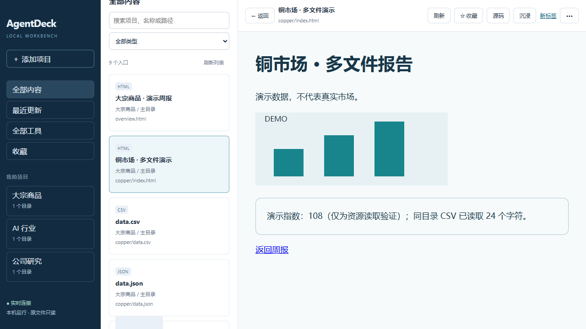

# AgentDeck — Agent HTML 研究报告阅读工作台

把 Agent 生成的 HTML 研究报告集中到一个本地工作台中，方便查找、阅读和对照。挂载报告所在的真实目录，原文件不搬迁、不改写。

## 为什么做这个应用

Agent 经常用 Markdown 交付研究结果，但一份面向用户阅读的分析报告，往往需要更直观地展示结论、图表、数据对比和来源。这个项目的主要初衷，就是让 Agent 优先生成适合阅读的 HTML 报告，并让这些报告有一个方便、持续使用的阅读入口。

HTML 可以灵活安排内容层次，展示图表和对比表格，也能加入目录跳转、筛选等交互。对需要理解分析结果的读者，这些能力比一长段文本更容易核对和使用。具体版式和交互由报告本身提供，AgentDeck 负责打开和展示。

另一个同样重要的初衷，是把阅读平台从文件编辑器转移到浏览器。Agent 或 Codex 生成的研究报告、Markdown 文档和分析资料，经常附有引用网页、来源链接和原始资料入口。阅读时需要顺着链接查看出处；如果主要在文件资源管理器或编辑器里看，就要反复切换到浏览器，打断阅读和核对过程。

AgentDeck 因此把本地报告也放进浏览器阅读：在工作台看分析，点击引用打开网页，查看原始出处后继续读报告。HTML 报告和 Markdown 中的链接是这条阅读流程的一部分。它希望解决的是“方便地阅读 Agent 成果并核对依据”，同时提供更直观的 HTML 展示和更连贯的浏览体验。

Markdown 仍适合编程文档、过程笔记和需要直接编辑的文字材料，因此保留支持。CSV、JSON、代码和静态工具也可以访问，作为核对报告的资料与辅助能力。**HTML 研究报告是主要阅读对象，其他文件能力围绕它提供支持。**

典型使用方式：请 Agent 把研究结果写成 HTML，保存到指定目录 → 在 AgentDeck 中打开报告 → 阅读结论和图表 → 点击引用网页核对原始出处，再回到报告 → 把具体修改意见反馈给 Agent → 加载更新后的报告。新报告不需要接入平台源码，也不要求搬进统一仓库。工作台内的报告标签和浏览器中的来源网页标签各有用途；当前外部网页按普通浏览器链接打开，不代表已接入工作台内部标签。



[竖屏界面](docs/screenshots/workbench-portrait.png) · [沉浸界面](docs/screenshots/workbench-immersive.png)

## 启动

需要 Node.js 22.12+。

```powershell
npm ci
npm run dev
# 或正式模式
npm run build
npm start
```

打开 http://127.0.0.1:4310 。预览使用独立来源 4311，仅监听回环地址；使用 `127.0.0.1`，不接受 localhost 别名，不静默换端口。

Windows 后台安装与更新：

```powershell
npm run background:install
npm run background:update
npm run background:status
```

其他命令和日志位置见 [后台运行说明](docs/BACKGROUND.md)。默认注册表在 `%LOCALAPPDATA%\AgentDeck\state\registry.json`；其他系统在 `~/.local/share/AgentDeck/state/registry.json`。自定义状态路径：

```powershell
npm start -- --state-dir "D:\AgentDeck-State" --port 4310 --preview-port 4311
```

同一个状态目录只运行一个实例。首次默认启动仍兼容旧 `ProjectWorkbench` 注册表迁移，保留原文件和备份。

## 文件与目录

- 点击左侧“＋”添加项目并挂载目录，支持粘贴路径和网页目录选择器。原文件始终留在原位置。
- 项目是目录分组；仅一个挂载时直接用项目名表示根目录，避免重复层级。节点“⋯”管理项目与挂载，多目录项目在项目标题中管理。
- 点目录三角或名称，一次点击展开并读取直接子项；未展开的子目录不读取，不建立递归入口索引、不读取 HTML 标题。
- 同层顺序是文件夹、HTML / CSV / Markdown、其他文件，组内按名称自然排序。模板文件只在真实所在目录中出现。
- 已展开且祖先展开的目录每 4 秒刷新一次；页面隐藏时暂停。手动刷新不重置展开状态、选中项或当前预览。
- 筛选只匹配已经加载的文件与目录，保留匹配文件的祖先结构；不会触发全目录搜索。
- 文件视图右上角的漏斗按钮可按后缀选择白名单或黑名单，也可添加自定义后缀和选择无后缀文件。白名单只显示所选类型，黑名单隐藏所选类型；目录始终可展开。规则保存在当前浏览器，只影响文件树显示，不删除文件，也不关闭已经打开的文档；收藏和工具列表保持独立。
- 每行 28px、13px 字号，单列单行。路径放在悬停提示和“更多”中，时间与类型标签不占独立行。
- 停用、卸载和移除项目只改变登记，不删除源文件。目录离线显示节点错误，恢复后可重试或等待下一次目录读取。

文件树显示允许访问的普通文件。HTML、Markdown、CSV、TXT、JSON 和常见代码可打开；其他文件提供下载。代码只读、不执行。仍排除隐藏敏感目录、密钥、依赖和用户明确排除的路径；不跟随 symlink/junction。

## 工具、阅读与收藏

“工具”是独立于收藏的 HTML 分类。进入侧栏“工具”，点击＋，从已挂载目录中选择 HTML 并填写可选名称；也可在当前 HTML 预览的“更多”中加入工具。工具登记保存在项目注册表，重启后保留；移除只取消分类，原文件和收藏不受影响。已有工具根据旧登记和位置映射恢复，不进行递归发现。

HTML 保持原目录关系加载相邻资源；Vite 工具请使用 `base: './'`，SPA 推荐 hash 路由。不会自动构建、执行包脚本或把模板解释为独立报告。Markdown 支持 GFM、相对图片/文档和标题锚点，关闭原始 HTML并过滤危险链接。CSV/JSON 保留原文，不做表格或树形转换。文本超过 10 MiB 时提供下载。

当前打开文件每 4 秒检查自身版本。HTML 更新始终提示手动加载，保留已有输入；文本可在“更多”中开启自动更新。只改引用的 CSS、JS、图片等资源时，请手动刷新当前预览；平台不递归遍历依赖目录。

星标收藏可直接打开，不要求先展开目录。新链接和收藏按挂载 ID 与相对路径定位，重启、项目改名和挂载重新定位后，相对路径不变则继续有效。收藏仍保存在浏览器 localStorage；文件删除或离线不自动删除收藏。真实文件改名不自动追踪。

旧版本仅保存不可逆的索引 ID。通过 `background:update` 更新正在运行的旧版时，会保存现有索引中的文件位置映射，自动迁移旧收藏和链接，不重新扫描。若更新前旧服务已停止、没有映射，旧收藏仍保留，展开对应目录时自动迁移；未关联的收藏显示恢复提示。旧显示名称和刷新偏好按原 ID 兼容读取。旧工具用途和入口配置留在注册表中用于兼容，不再触发自动发现或工具包折叠。

## 使用帮助与 Agent 协作

点击顶部“使用帮助”，或空工作台中的“如何使用与协作”，查看快速上手、高效使用、与 Agent 沟通、任务模板和常见问题。帮助打开期间保留当前预览，关闭后可继续阅读或使用工具；原有“？”快捷键帮助继续可用。

“任务模板”提供生成报告、制作工具、反馈修改和交接任务四种场景。选择成果目录后，可带入真实挂载路径；修改和交接模板在目录匹配时带入当前文件路径。复制到 Codex 或其他 Agent，替换所有待填写项后再发送。无挂载时可手动填写路径；复制受限时可在文本框中手动复制。

推荐循环：向 Agent 说明目标、资料、输出位置和验收标准 → Agent 在可访问的目录交付文件 → 在 AgentDeck 中展开、阅读或试用 → 用具体路径、现象和期望反馈 → 加载更新后验收。挂载不代表向 Agent 授予目录权限，也不会自动共享当前页面或对话上下文。

[产品定位与优化方案](docs/PRODUCT-PLAN.md) 记录了本次帮助功能的设计和后续建议。[帮助页面截图](docs/screenshots/help-desktop.png) · [任务模板截图](docs/screenshots/help-prompts.png)。

## 布局与快捷键

顶部“主题”可选跟随系统（默认）、浅色、深色，选择保存在当前浏览器。跟随系统时实时响应系统变化；手动选择时保持所选配色。主题覆盖工作台、Markdown / 文本、标签、帮助和弹窗，切换不重载报告。HTML 报告有自己的配色，本阶段不修改报告内容或强行反色；报告内部的夜间适配需由报告自身提供。

[浅色界面](docs/screenshots/theme-light.png) · [深色界面](docs/screenshots/theme-dark.png) · [窄屏深色界面](docs/screenshots/theme-mobile-dark.png)

顶部“设置”在工作台上方打开浮窗，按文件打开、阅读布局、快捷键、外观分类，更改自动保存。可点击关闭按钮、浮窗外侧或按 Esc 收起；打开和关闭不会卸载报告。设置保存在当前浏览器；存储不可用时仍可在当前会话使用。

HTML 默认在工作台标签页打开，可在设置中改为浏览器新标签页。文件、收藏和工具列表中的 HTML 有“打开方式”菜单，可明确选工作台、浏览器新标签页或另一阅读区；显式选择优先于默认设置。浏览器新标签页直接显示 HTML 本身，工作台内的“新标签”按钮也使用此方式。普通外部 HTTP(S) 链接默认在浏览器新标签页打开；本地链接、锚点、下载和工具路由不被统一改写。

每个阅读区顶部是标签栏，左侧目录上方是当前操作区可折叠的“已打开页面”。斜体标题和细微虚线边界表示临时预览，标签内不显示“临时”和常驻保留按钮。单击另一个尚未打开的文件会替换该区临时标签；双击文件列表中的文件、双击标签或右键标签选择“保留标签页”可保留它，标题恢复正体。已打开标签不会因 HTML 默认打开方式而跳到浏览器。问号帮助中有完整说明。

保留页面之间切换不会重载 HTML，也会保留工具输入和阅读位置。关闭当前页时优先切回最近使用的剩余页面；刷新只影响当前页。后台暂停工作台的文件版本检查，切入时再检查；HTML 自己的脚本仍可能运行。需要保留输入时请先保留页面，关闭、替换或刷新仍会重新加载内容。整组页面和工具输入不会跨浏览器刷新或重启恢复。

标签栏中可用左右方向键、Home / End 切换。来源网页通过报告或 Markdown 中的普通链接打开，通常位于独立浏览器标签；原报告的保留标签用于返回继续阅读。已打开列表使用固定的有限高度，避免双击期间目录位置跳动；列表可内部滚动或折叠。

顶部布局菜单可选择单屏、左右分屏、上下分屏；横屏竖屏均可自由选择。两个阅读区各有标签、临时预览、输入状态和浏览历史，也能分别打开同一文件。点击正文或工具栏激活该区，侧栏操作作用于最后激活的阅读区。“在另一阅读区打开”会保留该文件并在需要时开启分屏。

拖动阅读区分隔线调整比例，双击恢复一半；聚焦分隔线可用方向键、Home / End 调整。左右、上下分别记住比例。单屏只收起另一区，恢复分屏可继续阅读。切换方向或大小不会重新创建 iframe；HTML 自身响应式排版可能改变文字位置。

左侧文件树可拖动调宽、收起。小于等于 640px 的窗口使用左侧抽屉，打开文件后收起。宽度、折叠状态在浏览器中保存。

沉浸隐藏侧栏，退出后恢复；调整布局不重新挂载 iframe，也不重置阅读滚动位置。

阅读区顶部的一行图标依次提供刷新、收藏、浏览器新标签、分屏打开、查看源码／返回阅读、复制原文和更多操作；悬浮可查看每个图标的说明。分屏或缩窄窗口时，放不下的操作从右向左收进“更多”浮层，宽度恢复后自动回到工具栏。浮层不改变阅读区域尺寸；点击页面其他位置、HTML 内容或按 Esc 可关闭。关闭文档使用标签页上的 ×。

设置浮窗的“阅读布局”提供 12–24 px 文档字号滑杆，自动保存并作用于 Markdown 与纯文本；HTML 页面和 HTML 源码沿用原有字号。

| 快捷键 | 操作 |
| --- | --- |
| Alt＋← / → | 当前阅读区文件后退 / 前进 |
| B | 展开 / 收起文件侧栏 |
| F | 进入 / 退出沉浸 |
| / | 筛选已加载文件或收藏；沉浸中临时展开侧栏 |
| Esc | 逐层关闭弹窗、更多设置、临时筛选或沉浸 |
| ↑ / ↓ | 移动文件树焦点，不自动打开文件 |
| ← / → | 收起 / 展开聚焦的目录 |
| Enter | 打开聚焦文件，或筛选框中的首个文件结果 |
| ? | 快捷键帮助 |

文件历史按查看顺序记录，与临时标签是否被替换分开管理；每区保留最近 100 次访问。后退后打开新文件会截断前进分支，切换已打开标签也计入历史，滚动和网页内锚点不计入。到头时 Alt 导航停留在工作台。仍保留的页面延续输入；重新打开已替换或关闭的文件会加载内容，并尽量恢复普通文本或 HTML 文档滚动位置，不恢复任意未保存表单或内部嵌套滚动容器。浏览器新标签不计入工作台历史。

设置中可分别控制单键命令和 Alt 文件导航。内嵌 HTML 默认“网页优先”，可切换“工作台优先”，也可在每个 HTML 的更多设置中覆盖。工作台优先时，在 HTML 内也能使用工作台快捷键，并抑制冲突的网页按键。输入框、编辑区域和中文输入法组词时不触发单键命令；其他浏览器和系统组合键保留原行为。

本地预览服务临时注入桥接脚本，不修改原 HTML 文件，下载和源码保持原文件内容。父子页面校验消息来源、具体 iframe 和会话；顶级独立 HTML 不接管工作台快捷键。第三方/内层 iframe、策略阻止脚本、过长且无法安全确定的文档开头等场景不保证接管，页面会显示“未接管”提示。普通外链新标签处理不依赖快捷键模式，也不尝试改写任意脚本导航。

## 边界与安全

本地单用户、可信目录工作台。主界面与预览不同来源；Host、Origin、Fetch Metadata、JSON 和请求头校验保护管理接口。每次读取、预览和下载都检查真实路径、挂载状态与排除规则；代码文件可读取不代表能作为脚本从预览来源执行。

所有项目共用预览来源，不提供项目间机密隔离。可信 HTML 可按浏览器规则联网，不提供 CORS 代理。根绝对资源路径、history 路由、SSR、后端 API、Service Worker、云部署和 UNC 不自动支持。

注册表串行保存并保留 `.bak`，损坏时停止而不覆盖。恢复前先停服务。状态目录不能处于挂载范围内。

## 示例与检查

示例不会自动挂载，可选 `examples/commodities`、`examples/ai`、`examples/company/reports` 和 `examples/company/tool/dist`。所有层级按真实目录浏览。

```powershell
npm run typecheck
npm test
npm run build:example
npm run build
npm run test:e2e
```

浏览器测试在隔离状态和临时目录中使用本机 Edge；正式服务 4410/4411，恢复测试 4420/4421，开发冒烟 4430/4431/4432。非 Windows 可设置 `PLAYWRIGHT_CHANNEL=chromium`。

[测试记录](docs/TEST-RESULTS.md) · [问题日志](docs/ISSUES.md) · [内容输出约定](docs/CONTENT-GUIDE.md)。原 V1 规格与历史实施记录保留用于追溯；当前目录浏览、布局和更新行为以本说明为准。
